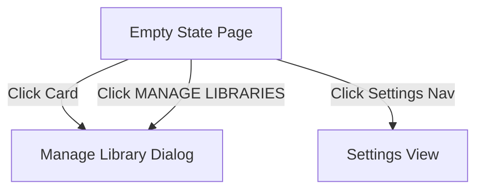

# Product Requirement Document (PRD): Modkeeper UI Redesign & Smart Integration

## 1. Document Control & Metadata
*   **Title:** Product Requirement Document (PRD) - Modkeeper UI Redesign
*   **Status:** Draft
*   **Author:** Antigravity (Advanced Agentic Coding)
*   **Target Release:** 2026-05-10 Redesign (Phase 3 & 4)
*   **Version:** 1.0.0
*   **Framework:** Tauri (Rust Backend + React/TypeScript Frontend)

---

## 2. Executive Summary & Design System Integration

### 2.1 Overview
Modkeeper is a high-fidelity desktop mod manager tailored for advanced game modding setups—specifically single-player modifications like SPT-AKI (Single Player Tarkov). The 2026-05-10 redesign focuses on converting an inconsistent user interface (mixing Fluent Design and standard web layouts) into a unified, premium desktop experience named **Fidelity Modern**.

### 2.2 Fidelity Modern Design Language
The UI is built upon the tokens defined in [DESIGN.md](file:///d:/Development/Projects/Martes/Modkeeper/docs/2026-05-10_redesign/ui/fidelity_modern/DESIGN.md):
*   **Backdrop & Depth:** Mica-glass translucency (`backdrop-filter: blur(24px) saturate(140%)` for standard; `blur(40px) saturate(160%)` for strong overlays) over warm, fluid radial gradients.
*   **Color Accents:** Vibrant Primary Pink (`#e91e63`) representing action and energy, balanced by muted secondary colors and deep teal tertiaries.
*   **Geometry:** High pill roundedness (Level 3: `1rem / 16px` for standard controls, `2rem / 32px` for dialogs/cards) producing a friendly, modern, and tactile physical feel.
*   **Typography:** Use **system/sans-serif** as the default font for support of languages, with weight-based visual hierarchies (headline-lg bold, body-md regular, label-md medium with 0.5px letter spacing).

### 2.3 Global UI & AI Scope Rules
*   **Window Controls & Title:** The window control, where the app title sits, is not a part of this design. The title doesn't change when switching tabs, and remains as **Modkeeper**.
*   **AI Functionality:** This app does not include active AI functions. Almost all proposed AI integration features are marked as **Not Planned**. The only exception is semantic searching in the library, which is considered for the future.

---

## 3. Screen-by-Screen Breakdown, Interactions, and Control States

This section breaks down the six core user interface screens, documenting visual structures, interactive elements, state machines, backend API calls, and AI integrations.

---

### Screen 1: Library - Empty State (Activate Library)
*   **Target Folder:** [library_activate_library_empty_state](file:///d:/Development/Projects/Martes/Modkeeper/docs/2026-05-10_redesign/ui/library_activate_library_empty_state/code.html)

#### 1. Description & Purpose
Provides the landing view when a user launches the app for the first time or has no modding profiles active. It prompts the user to activate a library.



#### 2. Visual & Structural Elements
*   **Header:** Standard window controls (title remains "Modkeeper" and does not change when switching tabs), title "Library", subtitle "Click to create or activate a library".
*   **Toolbar:** The toolbar is not rendered in this empty state.
*   **Central Card:** 16:9 dashed boundary box containing a cloud upload icon, header text, description text, and a prominent "MANAGE LIBRARIES" action button. (Note: This card is identical to the one displayed when there are no mods in an activated library, sharing the same component).
*   **Navigation Bar:** Positioned at bottom center, displaying "Home" (active state) and "Settings" (inactive).

#### 3. Interaction & Control States

| Control Element | Trigger Event | Resulting Action / Switch | Visual Feedback |
| :--- | :--- | :--- | :--- |
| **Central Card** | Hover | Cursor changes to pointer. | Border shifts from `gray-400/50` to `primary/50`; background tints to `white/30` with scale transition. |
| **Central Card** | Click | Opens the "Manage Library" dialog overlay. | Dialog slides up/fades in with backdrop blur. |
| **"MANAGE LIBRARIES" Button** | Click | Opens the "Manage Library" dialog overlay. | Dialog slides up/fades in with backdrop blur. |
| **Bottom Navigation (Settings)** | Click | Switches application view to Settings. | Page content fades out, loading Settings panel. |

#### 4. Backend API Contract
*   `get_profiles()`: Fetches all registered libraries. Returns `Result<Vec<ProfileDTO>, AppError>`.

#### 5. AI Integration Requirements
*   **AI Game Root Detection Engine:** Not Planned.

---

### Screen 2: Library - Empty State (Drop Zone Overlay)
*   **Target Folder:** [library_minimalist_empty_state_drop_zone](file:///d:/Development/Projects/Martes/Modkeeper/docs/2026-05-10_redesign/ui/library_minimalist_empty_state_drop_zone/code.html)

#### 1. Description & Purpose
An active drop-zone card shown when a profile is selected but contains no mods. It accepts dragged compressed files (`.zip`) to launch the automatic installation pipeline.

#### 2. Visual & Structural Elements
*   **Header:** Shows active profile metadata (e.g. "0 Mods Installed" when empty).
*   **Central Card:** Large container with a cloud icon, instruction text "Drag and drop zip files here to install, or click to browse local files". The card is identical to the one displayed in the unactivated library state (sharing the same component). The entire card is clickable to browse for files.
*   **Supported Formats Badge:** Located in the bottom-right corner of the drop zone, indicating support for `.zip` files.

#### 3. Interaction & Control States

| Control Element | Trigger Event | Resulting Action / Switch | Visual Feedback |
| :--- | :--- | :--- | :--- |
| **Window / Drag Area** | Drag Enter | Accepts `.zip` drags. | No special drop-in layout activation or border pulsing on the card. |
| **Window / Drag Area** | Drag Leave / Cancel | Reverts to default state. | No visual shift. |
| **Window / Drag Area** | File Drop | Extracts `.zip` files, calls backend parser. | Replaces content with installation progress bar/spinner. |
| **Central Card** | Click | Launches native file selector filtered by `.zip`. | OS File Selector overlay appears. |

#### 4. Backend API Contract
*   `install_mod_from_archive(archive_path: String)`: Sends path of compressed `.zip` file to backend. Unpacks, identifies files, places them in the target folder, and updates the local mod manifest. Returns `Result<ModDTO, AppError>`.

#### 5. AI Integration Requirements
*   **AI Mod Archive Layout Parser:** Not Planned.

---

### Screen 3: Library - Title Only View (Grid List)
*   **Target Folder:** [library_minimalist_title_only_view](file:///d:/Development/Projects/Martes/Modkeeper/docs/2026-05-10_redesign/ui/library_minimalist_title_only_view/code.html)

#### 1. Description & Purpose
The main dashboard where users manage installed mods. It presents a grid layout of cards indicating the state of each mod, allowing rapid enabling, disabling, selection, and bulk actions.

```
+--------------------------------------------------------------------------------+
| Select All [ ]   Name v   Filter v                    Search: [Search mods...]  |
+--------------------------------------------------------------------------------+
|  [ ] (Icon) Expanded Inventory       [x]  |  [x] (Icon) Amands Graphics    [x] |
|  [x] (Icon) Trader Scrolling          [ ]  |  [ ] (Icon) SAIN AI 2.0         [x] |
+--------------------------------------------------------------------------------+
```

#### 2. Visual & Structural Elements
*   **Toolbar Card:** A thin top panel providing check-all functionality, Sort-by-Name selection, Filter options, a badge-style "ACTIONS [Count]" bulk button, and a text search bar.
*   **Mod Grid:** Responsive column grid (1 column on mobile/small windows, 2 on XL, 3 on XXL).
*   **Mod Card Component:**
    *   Leftmost: Selection checkbox.
    *   Center-Left: Stylized category icon container (gradient color matching the mod type).
    *   Center-Right: Truncated mod title.
    *   Rightmost: Toggle switch (Enable/Disable).

#### 3. Interaction & Control States

| Control Element | Trigger Event | Resulting Action / Switch | Visual Feedback |
| :--- | :--- | :--- | :--- |
| **Individual Card Checkbox** | Check / Uncheck | Updates selected mods array. | Toggles checkbox check. Increments or decrements count in "ACTIONS [X]" button. |
| **"Select All" Checkbox** | Toggle | Checks or clears all visible mod checkboxes. | Selects/deselects all rows. Actions count updates to maximum or zero. |
| **Card Toggle Switch** | Toggle On | Enables mod. Backend creates symlinks by default, falling back to copying files. | Switch slides right, background changes to pink. Card gets a pink border/tint (`border-primary/20 bg-primary/5`). |
| **Card Toggle Switch** | Toggle Off | Disables mod. Backend removes symlinks or copied files. | Switch slides left, background fades to grey. Card opacity falls to `opacity-60`. |
| **Search Input** | Input text | Triggers local filter of list. | Grid items filter in real-time. |
| **"ACTIONS" Button** | Click | Opens dropdown for bulk operations (Enable, Disable, Delete, Group). | Dropdown menu list floats below the button. |

#### 4. Backend API Contract
*   `toggle_mod_status(mod_id: String, enabled: bool)`: Returns `Result<ModDTO, AppError>`.
*   `bulk_update_mods(mod_ids: Vec<String>, action: ModAction)`: Applies Enable/Disable/Delete to selected IDs. Returns `Result<Vec<ModDTO>, AppError>`.
*   `get_installed_mods(query: SearchQuery)`: Filters and sorts mods. Returns `Result<Vec<ModDTO>, AppError>`.

#### 5. AI Integration Requirements
*   **AI Category Classifier:** Not Planned.
*   **Semantic Mod Search:** Not planned for now. However, semantic searching in the library is the only AI integration to be considered in the future.
*   **Real-time Mod Conflict Solver:** Not Planned.

---

### Screen 4: Dialog - Configure Tool
*   **Target Folder:** [configure_tool_unified_component_style](file:///d:/Development/Projects/Martes/Modkeeper/docs/2026-05-10_redesign/ui/configure_tool_unified_component_style/code.html)

#### 1. Description & Purpose
A modal overlay for registering or editing external executables (e.g. game servers, mod launchers, configuration editors) tied to the active library profile.

#### 2. Visual & Structural Elements
*   **Outer Overlay:** Subtle dark backdrop blur (`bg-slate-900/5 backdrop-blur-[2px]`).
*   **Dialog Body (Mica Strong):** Fixed width/height, rounded 3xl corners.
*   **Section 1: Tool Identity:** Fields for name input, preview thumbnail, and Icon path/URL input, with a "Browse" button placed to its right.
*   **Section 2: Executable Path:** Absolute text path field and a secondary "Browse" folder button.
*   **Section 3: Launch Arguments:** Monospace text area for passing command-line parameters (`e.g. -debug -nolog`).
*   **Footer:** Left-aligned "Delete Tool" button (styled red on hover), right-aligned "Cancel" and "Save Changes" primary button.

#### 3. Interaction & Control States

| Control Element | Trigger Event | Resulting Action / Switch | Visual Feedback |
| :--- | :--- | :--- | :--- |
| **"Browse" Executable Button** | Click | Launches file picker restricted to executables (`.exe`). | Native file selection dialog appears. |
| **"Browse" Icon Button** | Click | Launches file picker restricted to image files (`.png; .jpg; .jpeg; .ico`). | Native file selection dialog appears. |
| **Custom Inputs** | Focus | Sets active cursor state. | Border highlights to `#e91e63` (Primary Pink), background brightens. |
| **"Save Changes" Button** | Click | Commits data, closes modal. | Closes dialog with fade-out. |
| **"Cancel" / Close Button** | Click | Discards edits, closes modal. | Closes dialog, reverting changes. |
| **"Delete Tool" Button** | Click | Prompts user, deletes tool record. | Alert dialog appears; on confirm, modal closes. |

#### 4. Backend API Contract
*   `save_tool(tool: ToolDTO)`: Inserts or updates tool parameters in configuration database. Returns `Result<(), AppError>`.
*   `delete_tool(tool_id: String)`: Removes the tool record. Returns `Result<(), AppError>`.

#### 5. AI Integration Requirements
*   **AI Executable Auto-Configurator:** Not Planned.

---

### Screen 5: Dialog - Manage Library
*   **Target Folder:** [manage_library_unified_component_style](file:///d:/Development/Projects/Martes/Modkeeper/docs/2026-05-10_redesign/ui/manage_library_unified_component_style/code.html)

#### 1. Description & Purpose
A profile dashboard overlay. It allows users to switch between modding profiles, rename libraries, change paths, manage executables, rebuild caches, and activate the selected profile.

```
+--------------------------------------------------------------------------------+
| Manage Library                                                             [X] |
|                                                                                |
|  [Alpha Testing]  [Hardcore Run]  [Main SPT Profile (Active)]  [+]             |
+--------------------------------------------------------------------------------+
|  Library Identity: [ Main SPT Profile             ]              [ Save ]      |
|                                                                                |
|  Installation Paths:                                                           |
|  Game Root: [ C:\Games\SPT-AKI\Rel-3.8.0      ]  [ Copy ]  [ Open Explorer ]   |
|                                                                                |
|  Executable Tools:                                                             |
|  (dns) SPT Server      [ Launch ] [ Settings ]                                 |
|  (esports) SPT Launcher [ Launch ] [ Settings ]                                 |
|  + Register New Tool                                                           |
+--------------------------------------------------------------------------------+
| [ Rebuild Cache ] [ Delete Library ]                           [  ACTIVATE ]   |
+--------------------------------------------------------------------------------+
```

#### 2. Visual & Structural Elements
*   **Top Nav Tabs:** Horizontal bar listing profile buttons. The active profile has a solid pink background (`#e91e63`). A dashed "+" tab is at the end.
*   **Section 1: Identity:** Edit field for renaming the selected profile tab.
*   **Section 2: Paths:** Card displays showing game folder pathways with action shortcuts.
*   **Section 3: Tools List:** Displays registered launch shortcuts, offering play and configure access.
*   **Footer Actions:** Utility shortcuts on the left ("Rebuild Cache", "Delete Library") and primary action "Activate" (displays disabled as "Activated" when active) on the right.

#### 3. Interaction & Control States

| Control Element | Trigger Event | Resulting Action / Switch | Visual Feedback |
| :--- | :--- | :--- | :--- |
| **Profile Tab** | Click | Switches active configuration panel. | Switched tab gains pink background, previous tab returns to white/40. |
| **"+" Tab Button** | Click | Opens a native folder selection dialog. If path is valid and not added before, adds a new library profile with that path and switches active tab to it. | New profile tab added and active. |
| **"Copy" Path Shortcut** | Click | Writes string to system clipboard. | Text changes temporarily to "Copied!" or toast is fired. |
| **"Open Explorer" Shortcut** | Click | Triggers backend shell command. | Native OS Explorer opens showing the target path. |
| **Tool "Launch" Button** | Click | Executes tool in background. | Play icon changes to a loading indicator or red stop icon. |
| **Tool "Settings" Button** | Click | Launches the "Configure Tool" modal. | Overlays tool configuration modal. |
| **"Rebuild Cache" Button** | Click / Hover | Runs folder indexing scanner. | On hover, sync icon rotates. On click, progress bar displays. |
| **"Activate" Button** | Click | Activates the selected library profile. | Button text changes to "Activated" and button becomes disabled. |
| **"Delete Library" Button** | Click | Opens a confirmation dialog asking the user to confirm. A checkbox in the dialog allows the user to choose whether to delete actual files or just remove the profile entry from the app. | Confirmation modal overlays. |

#### 4. Backend API Contract
*   `get_profiles()`: Fetches all registered libraries. Returns `Result<Vec<ProfileDTO>, AppError>`.
*   `activate_library(profile_id: String)`: Activates the selected profile. Returns `Result<(), AppError>`.
*   `rebuild_library_cache(profile_id: String)`: Recalculates mod lists, paths, and manifest database files. Returns `Result<CacheStatus, AppError>`.
*   `execute_tool(tool_id: String)`: Runs executable. Returns `Result<ProcessId, AppError>`.

#### 5. AI Integration Requirements
*   **Mod Load Order Optimization Agent:** Not Planned.

---

### Screen 6: Settings View
*   **Target Folder:** [settings_fluent_mica_simplified](file:///d:/Development/Projects/Martes/Modkeeper/docs/2026-05-10_redesign/ui/settings_fluent_mica_simplified/code.html)

#### 1. Description & Purpose
Provides central controls to adjust user preferences, UI aesthetics, color themes, and regional language configurations.

#### 2. Visual & Structural Elements
*   **Body Container:** Centered single column list containing settings cards.
*   **Setting Row Components:** Individual rows containing:
    *   Left side: Bordered box showing category icon, bold label, and descriptive paragraph.
    *   Right side: Controls (buttons, color swatches, or selection dropdowns).
*   **Bottom Navigation Bar:** Floating dock centered, showcasing the Settings tab active.

#### 3. Interaction & Control States

| Control Element | Trigger Event | Resulting Action / Switch | Visual Feedback |
| :--- | :--- | :--- | :--- |
| **Theme Buttons** | Click | Updates active class on document. | Switched button takes white background + shadow. Window changes light/dark modes. |
| **Accent Swatches** | Click | Updates CSS variables. | Select swatch receives focus ring; other swatches gain `opacity-40`. UI highlights change color. |
| **Language Select** | Select Option | Modifies current localization resource. | Re-renders UI with translated strings. |

#### 4. Backend API Contract
*   `save_settings(settings: SettingsDTO)`: Writes JSON config data to disk. Returns `Result<(), AppError>`.
*   `get_settings()`: Reads global preference values. Returns `Result<SettingsDTO, AppError>`.

#### 5. AI Integration Requirements
*   **Natural Language Settings Assistant:** Not Planned.

---

## 4. Global Architecture & Backend Integration Rules

### 4.1 Interface - Service - Core/Util Boundary Rules
To enforce code cleanliness and maintainability, developers must strictly adhere to the architecture boundaries:
1.  **Interface Layer (`commands/`)**:
    *   Acts strictly as the bridge for Tauri IPC.
    *   Receives serializable inputs (DTOs or primitives), validates input syntax, calls the orchestration service, and returns `Result<T, AppError>`.
    *   *Forbidden:* Direct filesystem operations or business orchestration.
2.  **Service Layer (`core/*_service.rs`)**:
    *   Implements pipelines (e.g. `deployment_pipeline.rs`, `sync_service.rs`).
    *   Orchestrates core actions and handles errors. Cannot parse IPC contexts.
3.  **Core / Utility Layer (`core/*.rs`, `utils/`)**:
    *   Houses low-level filesystem methods (no business logic) and single-purpose utilities.
    *   *Forbidden:* Directly calling Tauri commands or importing service pipelines.

#### 4.2 API Contract Standards
All frontend-backend communications must follow these command signatures:
```rust
#[tauri::command]
pub async fn verb_noun(payload: PayloadDTO) -> Result<ResponseDTO, AppError>
```

### 4.3 Redesign Scope & Architecture Insights
*   **Load Order:** Mod load order management is Not Planned.
*   **Mod Detail, Live Console, and Conflict/Collision Visualizer:** Not currently planned.
*   **Mod Link Strategy:** Mods are enabled using symlinks by default, falling back to copying files if symlinks fail.
*   **Background Process Management:** Ignored for now to avoid cross-platform compatibility issues.

---

## 5. Non-Functional Requirements & Verification Plan

### 5.1 Verification Checklist
*   **Aesthetics Contrast Review:** Check text contrast against glass backgrounds using simulated dev tools.
*   **Window Bounds & Responsiveness:** Shrink/grow app window to ensure grid columns wrap and footer nav bars stay centered.
*   **Tauri API Tests:** Run unit tests for path parsing, command arguments validation, and file copy operations.
*   **Mock Verification:** Build mock profiles and test drag-drop inputs to evaluate backend handler routing.
